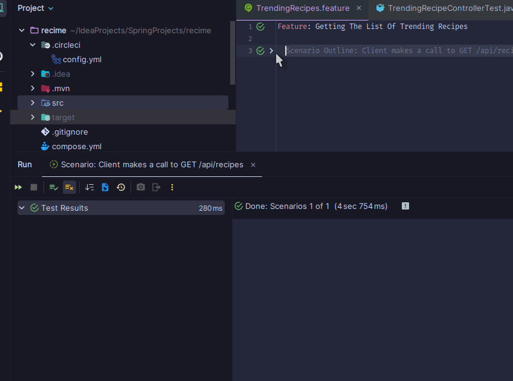

# ReciMe Java Spring Coding Challenge

## Overview
Create a Java application using the Spring framework to facilitate showing a list of trending 
recipes and ability to filter those recipes by difficulty.

## Objectives

The Java Spring application should consist of two RESTful APIs. The APIs include:

- Get a list of trending recipes.
- Get a list of trending recipes filtered by difficulty (easy, medium, or hard).

### Step 1

Create a request to get a list of trending recipes.

- You must return the list of trending recipes in JSON format.
- You must order recipes using a `position` property.
- You must use https://ddg0cip9uom1w.cloudfront.net/code-challenge/burger.jpg in a `imageUrl` property for all recipes.

### Step 2

Create a request to get a list of trending recipes filtered by difficulty (easy, medium, or hard).

- You must include a `difficulty` property for each recipe.
- You must provide the error message, “A difficulty is required for filtering trending recipes” if the request does not contain a difficulty.

### Step 3

Using Postman, create a collection that contains the above requests.

- You must export the collection and include it in the submitted repository.

*Bonus ⭐️: Add tests for the above requests either using Postman or Java Spring application.*

---

## How to test

For docker:
`docker compose up` 

For Spring Boot:
`mvn install` / `mvn test`

Tests available

- JUnit Application (Controller) Test
- Postman Tests (Import attached JSON collection file into Postman App)
- Cucumber Feature Tests (BDD)

__Note:__ _Docker Desktop must be installed to use docker compose and test containers_

_To run without docker, make sure Postgres is available
            at port 5432 with `postgres` as the username & password, however only 
Cucumber test will work, test containers require docker installed_

